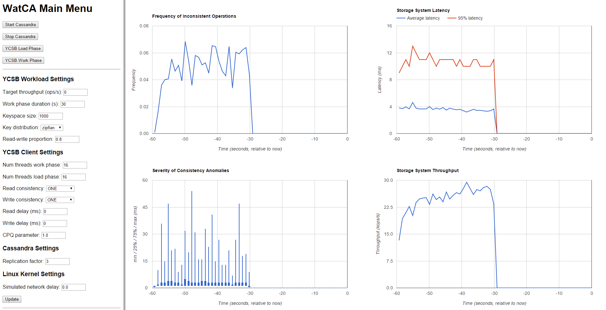

# WatCA: The Waterloo Consistency Analyzer

## Overview
WatCA is a tool for analyzing consistency in distributed storage systems and in concurrent data structures.
The current version supports key-value storage systems (e.g., Cassandra, Riak) that provide read and write (i.e., get and put) operations
and detects violations of [Herlihy and Wing's linearizability property](http://dl.acm.org/citation.cfm?id=78972).
The input to the tool is a log file that records the invocation and response of every operation applied
to the storage system, whose format is described below.

## Log Format
The log file must contain one invocation or response event per line.
Each line has the following general format:

    timestamp <tab> [INV|RES] <tab> client_ID <tab> [R|W] <tab> key <tab> value

The **timestamp** identifies each event uniquely.  The log file must be sorted in ascending order by timestamp.
**INV|RES** denotes the event type (invocation vs. response).
The **client_ID** corresponds to a process ID in Herlihy and Wing's model, and should be distinct
for each client process and thread.  You can construct it by concatenating the client's IP,
process ID, and thread ID.
**R|W** denotes the operation type (read/get vs. write/put).
The **key** and **value** denote the key-value pair, and must not contain any tabs.
(If in doubt, encode the values using base64 or hash them.)
The **value** is only included in the invocation event or a write and the response event of a read.

Sample log files are provided in the [samplelogs](../../tree/master/samplelogs) subdirectory.
One file is a positive example, meaning that it satisfies linearizability.
The other file is a negative example, meaning that it violates linearizability.
WatCA will identify one or more linearizability violations in the negative example,
and for each violation it will identify a key and a pair of values responsible for it.

To create your own log, you must instrument your client code by capturing the invocation
and response of each storage operation.
The utility class [ExecutionLogger.java](../../tree/master/src/main/java/ca/uwaterloo/watca/ExecutionLogger.java)
can be used for this purpose but only in the special case when all the client threads are in the same
Java process, as otherwise timestamps obtained using System.nanoTime() are incomparable.

**Note:** If a get operation fails to find a value for a given key, the corresponding log record should record a blank value.

## How-to: offline analysis
Instructions for Linux (tested on Ubuntu 14.04):

1. git clone https://github.com/wgolab/WatCA.git
2. cd WatCA; mvn install
3. cp samplelogs/execution.log.negative execution.log
4. ./lintest.sh
5. cat scores.txt

## How-to: real-time analysis
WatCA can be attached directly to a live NoSQL storage system for real-time consistency analysis.
The real-time analyzer provides a graphical interface using an embedded web server.
For details please navigate to the [realtime](realtime/) subdirectory.

**Note:** The real-time tool uses an older log format in which the invocation and response
events for an operation are represented using a single log record.
As a result, the real-time tool cannot deal correctly with operations that are
interrupted by failures.  Support for the new log format is coming soon.

## Development Team
- Hua Fan - PhD candidate
- Shankha Chatterjee - MASc candidate
- Wojciech Golab - Assistant Professor (https://ece.uwaterloo.ca/~wgolab/)

## Related Work
System | Paper | Authors | Description
--- | --- | --- | ---
[Knossos](https://github.com/aphyr/knossos) | | Kyle Kingsbury | a linearizability analyzer based on model checking techniques
ConsAD | (http://www.cs.mcgill.ca/~kzella/ConsAD.pdf) | Zellag and Kemme | a real-time consistency anomalies detector
[Conver](https://github.com/pviotti/conver-scala) | (http://www.eurecom.fr/fr/publication/4874/download/ds-publi-4874.pdf) | Viotti, Meiklejohn and Vukolic | a system for consistency checking
(https://github.com/ahorn/linearizability-checker) | (https://arxiv.org/abs/1504.00204) | Horn and Kroening | linearizability checker
(http://www.cs.ox.ac.uk/people/gavin.lowe/LinearizabiltyTesting/) | (http://www.cs.ox.ac.uk/people/gavin.lowe/LinearizabiltyTesting/paper.pdf) | Lowe | linearizability checker

## Funding Acknowledgment
Graduate students involved in this project were supported in part by the
[Natural Sciences and Engineering Council of Canada (NSERC)](http://www.nserc-crsng.gc.ca)
and the [Google Faculty Research Awards Program](http://research.google.com/research-outreach.html#/research-outreach/faculty-engagement/faculty-research-awards).